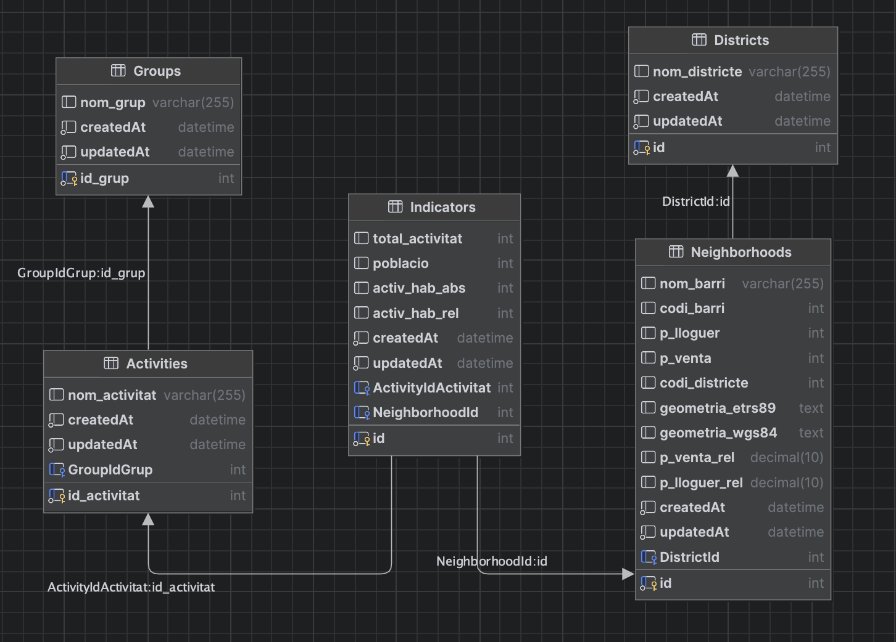

# Tech4good-Backend
Backend for the Tech4Good

## Installation

After cloning: 
- `npm i` to install node packages.
- `mysql -u root -p < scripts/init.sql` to create user and database.
- `npm start` to run the application.

## Endpoints

- GET '/distrito' A list of all the districts.
- GET '/distrito/:id' A list of all the neighborhoods from the district id.
- GET '/grupoActividad' A list of all the group of activities.
- GET '/grupoActividad/:id' A list of all the activities from a specific group.

## Data Model

